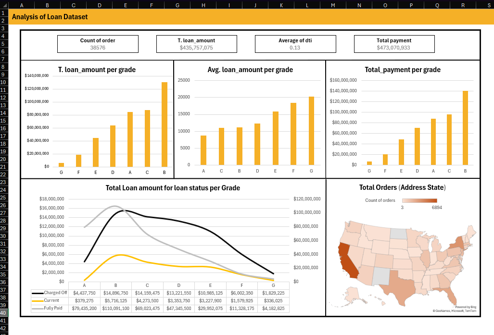

# 📊 Loan Dataset Analysis Dashboard (Excel)

An interactive **Loan Analysis Dashboard** built using **Microsoft Excel** to analyze loan performance, payment behavior, and risk distribution across loan grades and states.

This dashboard provides clear insights into loan amounts, debt-to-income ratios, payment status, and geographic distribution of orders.

---

## 🖼 Dashboard Preview

---

## 📌 Project Overview

This project analyzes a loan dataset to answer key financial and risk-related questions such as:

- Which loan grades receive the highest funding?
- How does average loan amount vary by grade?
- What is the total payment collected per grade?
- How are loans distributed across states?
- What is the performance of loans by status (Charged Off, Current, Fully Paid)?

---

## 🔢 Key KPIs

- **Total Orders:** 38,576  
- **Total Loan Amount:** $435,757,075  
- **Average DTI (Debt-to-Income Ratio):** 0.13  
- **Total Payment Collected:** $473,070,933  

---

## 📊 Dashboard Analysis Sections

### 💰 Loan Amount Analysis
- Total loan amount per grade
- Average loan amount per grade
- Total payment collected per grade

### 📈 Loan Status Analysis
Loan amount distribution by:
- Charged Off
- Current
- Fully Paid

Helps evaluate risk exposure and repayment performance across grades.

### 🗺 Geographic Analysis
- Total orders by address state
- Interactive map visualization
- Identifies states with higher loan activity

---

## 🛠 Tools & Techniques Used

- Microsoft Excel
- Pivot Tables & Pivot Charts
- Map Chart Visualization
- Calculated Fields
- Aggregations (SUM, AVERAGE, COUNT)
- Dashboard layout design & formatting

---

## 🎯 Business Value

This dashboard helps:

- Analyze credit risk by grade
- Monitor repayment performance
- Identify high-loan-volume states
- Support financial decision-making
- Improve portfolio risk assessment

---

## 📂 Repository Contents

- `Loan Dashboard.xlsx` – Excel Dashboard file  
- `Loan.png` – Dashboard screenshot  
- `README.md` – Project documentation  

---

## 👩‍💻 Author

**Marwa Mohamed Aboelela**  
- GitHub: [marwamohamed51](https://github.com/marwamohamed51)

---

⭐ If you found this project useful, feel free to star the repository!
